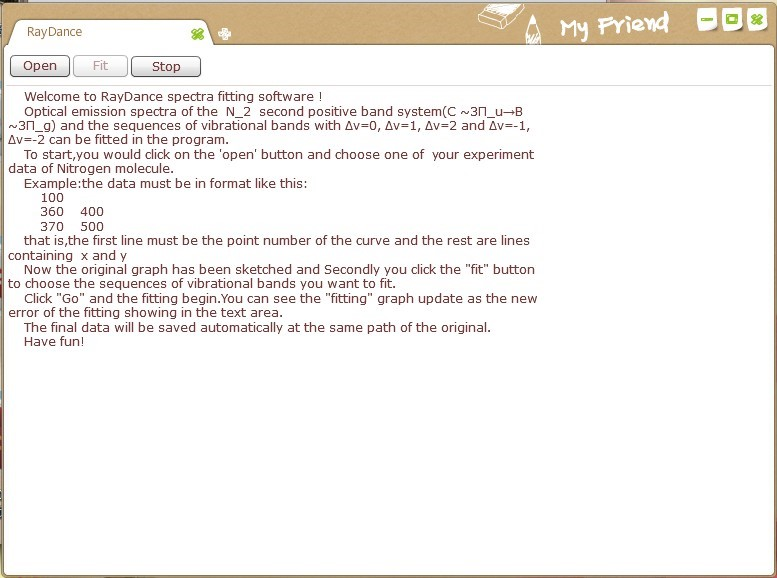
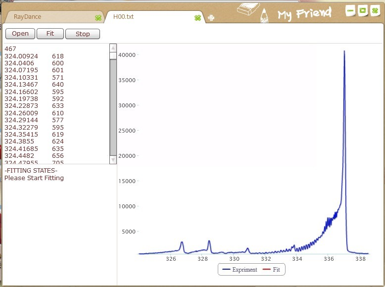
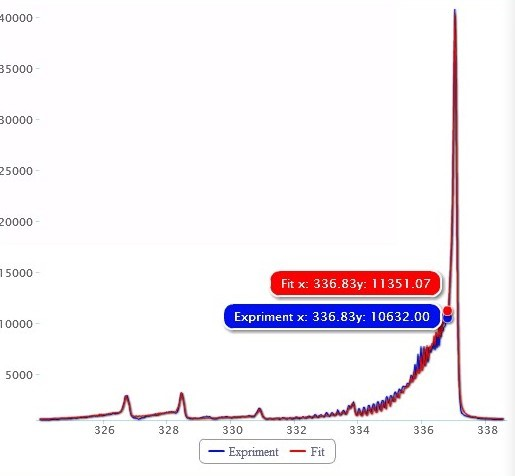
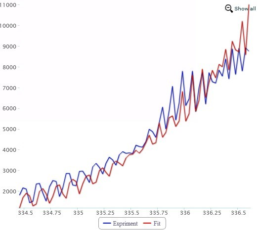

# RayDance

A spectra fitting package for  N2 plasma. 

> @Authour Yang Zhou

> @Mail  y_zhou13@fudan.edu.cn

> @Fudan University Computational Condensed Matter Group(CCMG)

# Summary

## What

- This is the GUI and computationl  codefor the project  **Study of Plasma With Nonlinear Fitting** .

- It's a plotting software based on Adobe Air.

- The GUI is an AS3.0 version of google chrome

	

## Usage

- Double click ono RayDance.exe to  open the main window.

- Click on open to load a spectra file, for example we choose example/H00.txt

	

- Click Fit to start fitting

- You can zoom the plot to check

	
	
